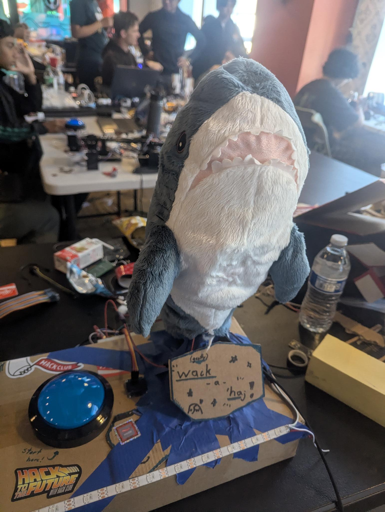
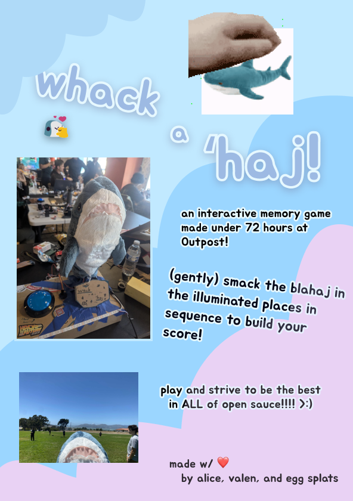

# whack-a-haj
> built under 72 hours at [Hack Club's Outpost](https://outpost.hackclub.com/), by alice, valen, and egg splats  

this is a simon-says-style game in the shell of an IKEA blåhaj! powered by the ADXL345 accelerometer and the Orpheus Pico!
* to play, simply whack the sharkie on the illuminated area part of their body. follow the pattern!

## wiring diagram
  
  

## cad
  
  

